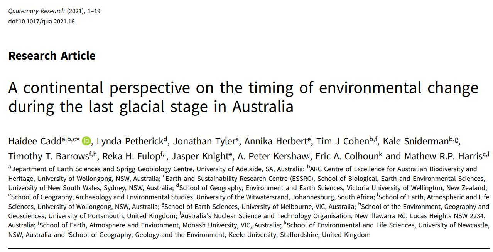

<!-- README.md is generated from README.Rmd. Please edit that file -->

```{r, include = FALSE}
knitr::opts_chunk$set(
  collapse = TRUE,
  comment = "#>",
  fig.path = "man/figures/README-",
  out.width = "100%"
)
```

# MCCPT

<!-- badges: start -->

<!-- badges: end -->

The **MCCPT** package conducts Monte-carlo changepoint analysis on paleoclimate records. It is an implementation of Rebecca Killick's [changepoint method](https://github.com/rkillick/changepoint/), but applied to paleoclimate records whilst accounting for age-model uncertainty.

**MCCPT** was developed originally for [Cadd et al. (2021)](https://doi.org/10.1017/qua.2021.16). If you use the package, please cite this paper. 

<p align="center">
  
</p>

If you have questions or comments, you can contact the package maintainers:

- [Haidee Cadd](https://github.com/h-cadd/) | haidee@uow.edu.au
- [Matt Harris](https://github.com/MRPHarris/) | m.harris@gns.cri.nz

## Using the package

### Installation

Install **MCCPT** with the devtools package: `devtools::install_github("h-cadd/MCCPT")`

### Using your data

Data must be structured in a specific way in order to be used with the package. **MCCPT** currently accepts .xlsx files with the following (on separate sheets):

1. 'Metadata', containing the entries 'Site code' (an abbreviation), and 'Data type' (i.e., Compositional or Single). Here is an example from the data included with the package:
```{r, echo = FALSE, eval = TRUE, collapse = FALSE, warning = FALSE, message = FALSE}
pacman::p_load(readxl, magrittr)
suppressMessages(
  NCL_metadata <- readxl::read_xlsx(
    path = "data-raw/Stradbroke-comp-raw/NativeCompanionLagoon_with ages.xlsx", 
    sheet = "Metadata", col_names = F)  %>% 
    'colnames<-'(c('category','value'))
  )
knitr::kable(NCL_metadata)
```

2. 'Data', containing a formatted data frame of the data you are interested in. This must have at least two columns:

- Depth_cm
- Any number of other columns containing proxy data (pollen species, d18O, etc.). This will be compressed into a principal curve.

3. 'Age_iterations', containing age model iterations of the proxy record at the same interval resolution as the proxy data.

Refer to the example data contained in the package (MCCPT/data-raw/Stradbroke-comp-raw/), derived from [Cadd et al. (2024)](https://onlinelibrary.wiley.com/doi/10.1002/jqs.3681?af=R).

### Running MCCPT

Once you have installed the package and formatted your data appropriately, run `conduct_MCCPT()`. This will generate:

- an R list of per-record changepoints, depending on your choices made whilst the program is running.
- an excel spreadsheet for each record, containing sheets corresponding to data for each changepoint.
- plots of each record, the position of changepoints, and their distribution within age model iterations.

## References

Cadd, H., Petherick, L., Tyler, J., Herbert, A., Cohen, T. J., Sniderman, K., … Harris, M. R. P. (2021). A continental perspective on the timing of environmental change during the last glacial stage in Australia. Quaternary Research, 102, 5–23. [doi:10.1017/qua.2021.16](https://doi.org/10.1017/qua.2021.16)

